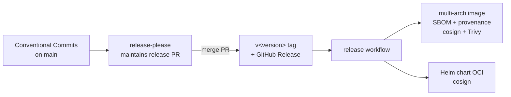

# Releasing

This page documents how **cwii** (Cluster Workload Identity Injector) is released: how a
version number is decided, how the container image and Helm chart are built, signed, and
published, and how you — as a platform engineer consuming cwii — can verify what you pull.

cwii ships two artifacts from a single Git tag:

| Artifact | Reference | Signed with |
| --- | --- | --- |
| Container image | `ghcr.io/cluster-workload-identity/cwii` | cosign (keyless) |
| Helm chart (OCI) | `oci://ghcr.io/cluster-workload-identity/charts/cwii` | cosign (keyless) |

The image is **distroless, nonroot (uid 65532), multi-arch (linux/amd64 + linux/arm64)**.

!!! info "You don't run any of this"
    Releasing is fully automated in GitHub Actions and gated on a merged release PR.
    This page exists so you can (a) understand where the artifacts you install come from
    and (b) verify their provenance. To *install* cwii, see [Install](./install.md).

---

## The release pipeline at a glance



There are two workflows, and they hand off via a Git tag:

- `.github/workflows/release-please.yaml` — runs on every push to `main`; maintains the
  release PR and, on merge, creates the tag + GitHub Release.
- `.github/workflows/release.yaml` — runs on push of a `v*` tag; builds, signs, and
  publishes the image and chart.

---

## 1. Versioning: Conventional Commits + release-please

cwii uses **[Conventional Commits](https://www.conventionalcommits.org/)** on `main`, and
**[release-please](https://github.com/googleapis/release-please)** to translate commit
history into a SemVer bump and a `CHANGELOG.md`.

### How the SemVer bump is derived

release-please scans the commits since the last release and picks the highest-ranked change:

| Commit type | Effect on version |
| --- | --- |
| `fix:` | **patch** bump (e.g. `0.3.1 → 0.3.2`) |
| `feat:` | **minor** bump (e.g. `0.3.1 → 0.4.0`) |
| `feat!:` or a `BREAKING CHANGE:` footer | **major** bump (e.g. `0.3.1 → 1.0.0`) |
| `chore:`, `docs:`, `refactor:`, `test:`, `ci:`, … | no release on their own |

!!! warning "Pre-1.0 behaviour (`bump-minor-pre-major`)"
    While cwii is in the `0.x` series, the config sets `bump-minor-pre-major: true` and
    `bump-patch-for-minor-pre-major: true`. The practical effect:

    - A **breaking change** bumps the **minor** (`0.3.1 → 0.4.0`), *not* to `1.0.0`.
    - A **feature** bumps the **patch** (`0.3.1 → 0.3.2`).

    SemVer rules for `0.x` allow anything to break, so this keeps the major at `0` until the
    project explicitly cuts `1.0.0`. The table above describes the post-1.0 mapping.

Config lives in `release-please-config.json` (release type `simple`, package name `cwii`,
changelog `CHANGELOG.md`) and the current version is tracked in
`.release-please-manifest.json`.

### The flow

1. You merge Conventional Commits into `main` (normally via PR).
2. `release-please` opens or updates a **release PR** titled like
   `chore(main): release X.Y.Z`. It contains the computed version bump and the generated
   `CHANGELOG.md` entry. This PR sits open and accumulates changes until you're ready.
3. **Merging the release PR** makes release-please create the **`v<version>` Git tag** and a
   **GitHub Release**.
4. The `v*` tag triggers the release workflow (section 2 onward).

!!! tip "Forcing or shaping a release"
    - Want a release *now*? Merge the open release PR.
    - Want to hold a release? Don't merge the PR; keep landing commits — they aggregate.
    - The tag separator is `-` and the component name is **not** included in the tag
      (`include-component-in-tag: false`), so tags are plain `vX.Y.Z`.

---

## 2. Image build, sign & scan

When a `v*` tag lands, the `image` job runs. The registry is `ghcr.io` and the image name is
`ghcr.io/cluster-workload-identity/cwii`.

It performs, in order:

1. **Multi-arch build & push** with Buildx + QEMU for `linux/amd64,linux/arm64`.
2. **Tagging** via `docker/metadata-action`. Three tag styles are pushed:

    | Tag pattern | Example (for `v1.4.2`, commit `abc1234`) |
    | --- | --- |
    | `{{version}}` | `1.4.2` |
    | `{{major}}.{{minor}}` | `1.4` |
    | `sha` | `sha-abc1234` |

3. **OCI labels** are baked into the image:

    ```text
    org.opencontainers.image.title=cwii
    org.opencontainers.image.description=Cluster Workload Identity Injector
    org.opencontainers.image.source=https://github.com/cluster-workload-identity/cwii
    org.opencontainers.image.url=https://cwii.dev
    org.opencontainers.image.licenses=Apache-2.0
    ```

4. **SBOM + provenance** generated by the build (`sbom: true`, `provenance: mode=max`) and
   attached to the image in the registry.
5. **cosign keyless signature** over the image *digest* (not a mutable tag):

    ```bash
    cosign sign --yes "ghcr.io/cluster-workload-identity/cwii@${DIGEST}"
    ```

6. **Trivy scan** of the released digest at `CRITICAL,HIGH`. It is **report-only**
   (`exit-code: "0"`) — it never fails an already-published release; treat its output as a
   signal to cut a follow-up `fix:` release, not as a gate.

!!! note "Keyless signing = Sigstore + GitHub OIDC"
    cosign keyless signing uses the workflow's GitHub OIDC token (the job has
    `id-token: write`) to obtain a short-lived certificate from Fulcio and records the
    signature in the Rekor transparency log. There is **no long-lived signing key** to
    manage or leak. This is what makes the verification in section 4 possible.

### Optional: mirror to Docker Hub

`ghcr.io` is the source of truth. You can additionally mirror each release to Docker Hub for
discoverability — but be aware of Docker Hub's **anonymous pull rate limits** (~100 pulls / 6h per
IP), which can throttle in-cluster pulls; prefer pulling from ghcr in clusters.

The mirror is **opt-in** and off by default. To enable it, set on the repository:

| Kind | Name | Value |
| --- | --- | --- |
| Variable | `DOCKERHUB_PUSH` | `true` |
| Variable | `DOCKERHUB_NAMESPACE` | Docker Hub org/user (optional; defaults to the GitHub owner) |
| Secret | `DOCKERHUB_USERNAME` | Docker Hub username |
| Secret | `DOCKERHUB_TOKEN` | Docker Hub access token (not your password) |

When enabled, the `image` job also logs into Docker Hub, adds
`docker.io/<namespace>/cwii` to the tag set (same multi-arch manifest and digest), and cosign-signs
the Docker Hub reference too. When disabled, the Docker Hub line resolves to an empty string and is
ignored, so nothing is pushed there.

---

## 3. Helm chart package, push & sign

After the image job succeeds, the `chart` job packages and publishes the Helm chart as an
**OCI artifact**. Both the chart `version` and `appVersion` are derived from the tag, so the
chart always pins the matching image:

```bash
VERSION="${GITHUB_REF_NAME#v}"          # v1.4.2 -> 1.4.2
helm package charts/cwii \
  --version "$VERSION" \
  --app-version "$VERSION" \
  --destination dist/
helm push "dist/cwii-${VERSION}.tgz" \
  "oci://ghcr.io/cluster-workload-identity/charts"
```

The chart is then cosign-signed by its digest, exactly like the image:

```bash
cosign sign --yes "ghcr.io/cluster-workload-identity/charts/cwii@${DIGEST}"
```

The published reference is `oci://ghcr.io/cluster-workload-identity/charts/cwii`.

---

## 4. Verifying what you pull (consumers)

Because both artifacts are keyless-signed, you can verify them with `cosign` and **no public
key** — you assert the *identity* (the workflow that signed it) and the *issuer* (GitHub's
OIDC provider) instead.

### Verify the image

```bash
cosign verify \
  --certificate-identity-regexp "^https://github.com/cluster-workload-identity/cwii/\.github/workflows/release\.yaml@refs/tags/v.*$" \
  --certificate-oidc-issuer "https://token.actions.githubusercontent.com" \
  ghcr.io/cluster-workload-identity/cwii:1.4.2 \
  | jq .
```

!!! tip "Pin to a digest in production"
    Tags are mutable. For reproducible, attack-resistant deploys, resolve the tag to a digest
    once and verify/deploy that digest:

    ```bash
    DIGEST=$(crane digest ghcr.io/cluster-workload-identity/cwii:1.4.2)
    cosign verify \
      --certificate-identity-regexp "^https://github.com/cluster-workload-identity/cwii/.*$" \
      --certificate-oidc-issuer "https://token.actions.githubusercontent.com" \
      "ghcr.io/cluster-workload-identity/cwii@${DIGEST}"
    ```

### Verify the chart

The chart is an OCI artifact, so the same `cosign verify` works against its reference:

```bash
cosign verify \
  --certificate-identity-regexp "^https://github.com/cluster-workload-identity/cwii/\.github/workflows/release\.yaml@refs/tags/v.*$" \
  --certificate-oidc-issuer "https://token.actions.githubusercontent.com" \
  ghcr.io/cluster-workload-identity/charts/cwii:1.4.2
```

### Inspect SBOM & provenance

```bash
# Software Bill of Materials attestation
cosign verify-attestation \
  --type spdxjson \
  --certificate-oidc-issuer "https://token.actions.githubusercontent.com" \
  --certificate-identity-regexp "^https://github.com/cluster-workload-identity/cwii/.*$" \
  ghcr.io/cluster-workload-identity/cwii:1.4.2

# SLSA provenance attestation
cosign verify-attestation \
  --type slsaprovenance \
  --certificate-oidc-issuer "https://token.actions.githubusercontent.com" \
  --certificate-identity-regexp "^https://github.com/cluster-workload-identity/cwii/.*$" \
  ghcr.io/cluster-workload-identity/cwii:1.4.2
```

!!! warning "Verify before you trust the rest of the docs"
    Signature verification only proves *who built the artifact*. It does not configure
    workload identity. After installing a verified image/chart, you still need the
    [self-hosted OIDC prerequisites](./self-hosted-oidc.md) and the right
    [pod annotations](./annotations.md) for injection to actually work. See also
    [Verification](./verification.md) for the in-cluster `can-i` verify init containers,
    which are a *different* concept from artifact signature verification.

---

## 5. A note on the Rust crates

cwii is a Cargo workspace (`cwii-core`, `cwii-provider-gcp`, `cwii-provider-aws`,
`cwii-provider-az`, and the `cwii` binary). **Every crate sets `publish = false`** — they are
**not** published to [crates.io](https://crates.io). The shipped, supported distribution
channels are the **container image** and the **Helm chart** described above.

If you need to build from source, clone the repo and build the workspace; do not expect
`cargo install cwii` to work.

---

## 6. Manual fallback

The automated pipeline is the supported path. If GitHub Actions is unavailable and you must
cut a release by hand, you can reproduce each step locally with a maintainer's GHCR
credentials. You lose keyless signing's GitHub-OIDC identity unless you run from a properly
configured environment — sign accordingly, and document the deviation in the release notes.

!!! danger "Maintainers only"
    These steps push to the public registry under `cluster-workload-identity`. They require
    `packages: write` access to GHCR and should only be run by maintainers, ideally never.

### 6a. Tag and release manually

If release-please cannot run, create the tag and GitHub Release yourself. Keep the
`v<version>` shape so consumers' verification regexes still match:

```bash
git tag -a v1.4.2 -m "release 1.4.2"
git push origin v1.4.2
gh release create v1.4.2 --generate-notes
```

Pushing the tag is normally enough — it triggers `release.yaml`. The steps below are only for
when the workflow itself cannot run.

### 6b. Build, push & sign the image

```bash
export REGISTRY=ghcr.io
export IMAGE_NAME=cluster-workload-identity/cwii
export VERSION=1.4.2

echo "$GHCR_TOKEN" | docker login "$REGISTRY" -u "$GITHUB_ACTOR" --password-stdin

# Multi-arch build + push with embedded SBOM and provenance.
docker buildx build \
  --platform linux/amd64,linux/arm64 \
  --push \
  --sbom=true \
  --provenance=mode=max \
  --tag "${REGISTRY}/${IMAGE_NAME}:${VERSION}" \
  --tag "${REGISTRY}/${IMAGE_NAME}:1.4" \
  --label org.opencontainers.image.title=cwii \
  --label org.opencontainers.image.description="Cluster Workload Identity Injector" \
  --label org.opencontainers.image.source=https://github.com/cluster-workload-identity/cwii \
  --label org.opencontainers.image.url=https://cwii.dev \
  --label org.opencontainers.image.licenses=Apache-2.0 \
  .

# Resolve the digest and sign it (interactive keyless OIDC flow if no CI token).
DIGEST=$(crane digest "${REGISTRY}/${IMAGE_NAME}:${VERSION}")
cosign sign --yes "${REGISTRY}/${IMAGE_NAME}@${DIGEST}"

# Optional but recommended: scan before announcing.
trivy image --severity CRITICAL,HIGH "${REGISTRY}/${IMAGE_NAME}@${DIGEST}"
```

### 6c. Package, push & sign the chart

```bash
export VERSION=1.4.2

echo "$GHCR_TOKEN" | helm registry login ghcr.io -u "$GITHUB_ACTOR" --password-stdin

helm package charts/cwii \
  --version "$VERSION" \
  --app-version "$VERSION" \
  --destination dist/

OUT=$(helm push "dist/cwii-${VERSION}.tgz" oci://ghcr.io/cluster-workload-identity/charts 2>&1)
echo "$OUT"
DIGEST=$(echo "$OUT" | awk '/Digest:/ {print $2}')

cosign sign --yes "ghcr.io/cluster-workload-identity/charts/cwii@${DIGEST}"
```

After a manual release, immediately run the [verification commands](#4-verifying-what-you-pull-consumers)
yourself to confirm the artifacts are signed and resolvable before announcing the release.

---

## See also

- [Install](./install.md) — pulling and deploying the verified chart/image.
- [Self-hosted OIDC setup](./self-hosted-oidc.md) — the kube-apiserver prerequisites.
- [Annotations reference](./annotations.md) — the `cwii.dev/*` annotations that drive injection.
- [Verification](./verification.md) — in-cluster `can-i` verify init containers.
